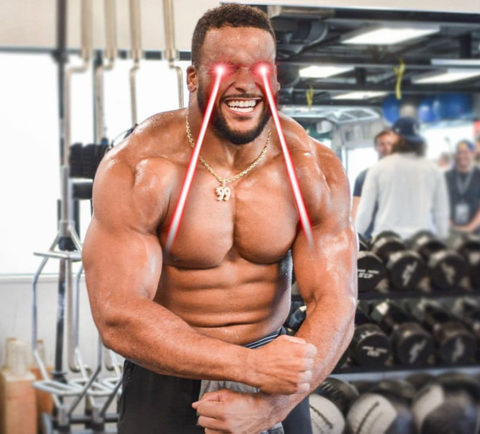

# Aarobo Donald

The biggest and scariest sumo robot at BSR.

## Electronics

### Arduino Shield

* [Datasheet](https://5.imimg.com/data5/PX/UK/MY-1833510/l293d-based-arduino-motor-shield.pdf)
  - up to 4 motors

### Ultrasonic Ranging

* [Datasheet](https://cdn.sparkfun.com/datasheets/Sensors/Proximity/HCSR04.pdf)
  - Features:
  - Operating Voltage: 5V
  - Working Current: 15 mA
  - Theoretical Distance Range: 2cm to 400cm
  - Practical Distance Range: 2 to 80cm
  - Reference: [https://www.osepp.com/electronic-modules/sensor-modules/62-osepp-ultrasonic-sensor-module]
  - Reference: [https://components101.com/sensors/ultrasonic-sensor-working-pinout-datasheet]

### Reflective Optical Sensor

* [Datasheet](https://www.vishay.com/docs/83751/cny70.pdf)